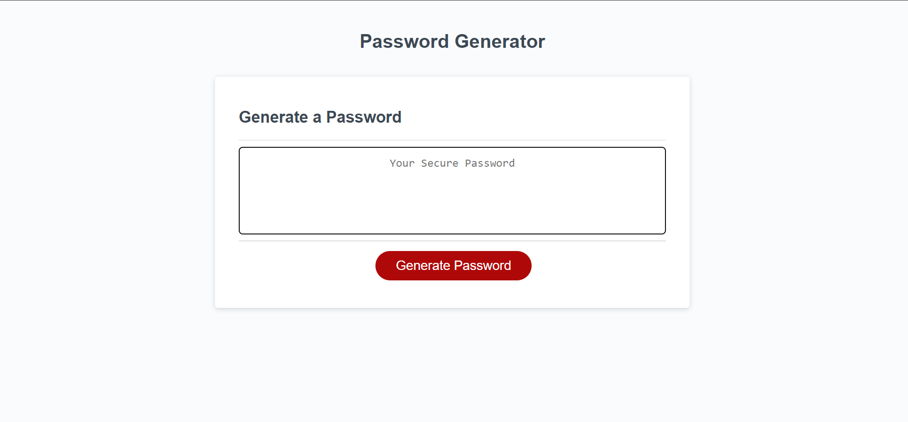
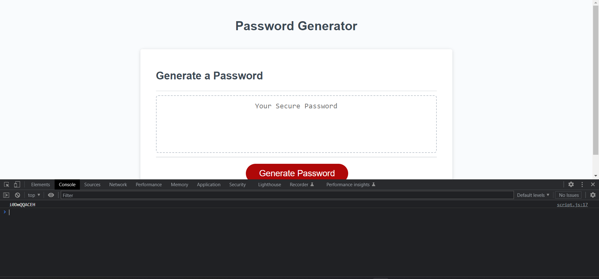

# <Password Generator>

## Description

- Sometimes what most people need is an auto generated password to solve all of their uppercase, special symbol, two number problems. This is especially true for those who work in the secret agencies, you know who you are 😉!
- Seeing as how there are obviously those who struggle with this utterly common problem this webpage was thusly created! As it is, most of us likely struggle enough with this brainteaser question that somehow pops up on every website nowadays, so I thought I'd give my shot at fixing it!
- Needless to say this webpage is rather self explanatory! However, understandably, there will always need to be some explanation given seeing as how every person does every little thing just a bit differently. Unique and eccentricities are a wonderful thing, and it can be said to be celebrated within this random password generator, it's all in the name after all!

## Usage

 - I managed to get the actual css linked, along with the javascript, however, I struggled along the way, and was unable to properly complete my assignment on time! But I have submitted what I have regardless! And I will continue to work on it without any time crunch until I can figure out what I am doing incorrectly!

